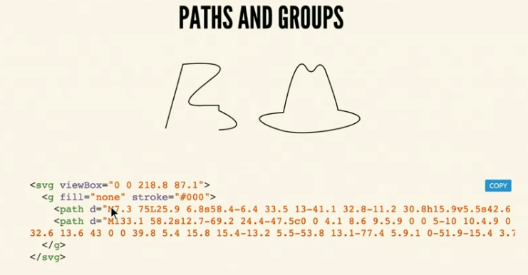
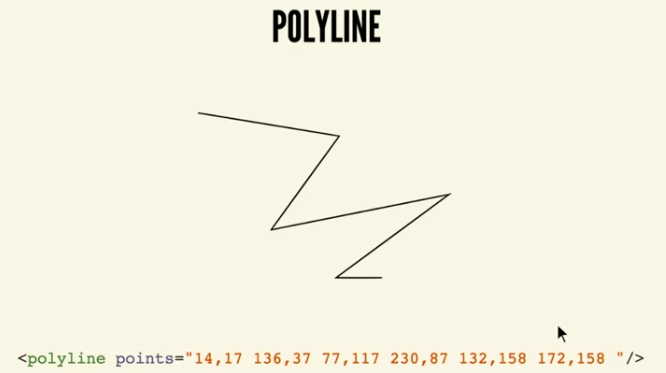
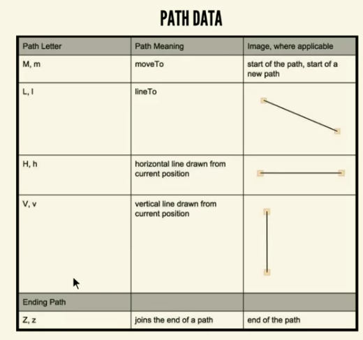
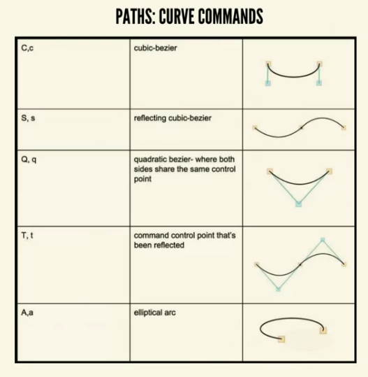

# Platonic shapes

```svg
<svg xmlns="" xmlns:xlink="" x="0px" y="0px" width="450px" height="100px" viewBox="0 0 450 100">
    <rect x="10" y="5" fill="white" stroke="black" width="90" height="90" />
    <circle fill="white" stroke="black" cx="170" cy="50" r="45" />
    <polygon fill="white" stroke="black" points="279,5 294,35 328.40 303,63 309.94 279,79" />
    <line fill="none" stroke="black" x1="410" y1="95" x2="440" y2="6" />
</svg>
```


# preserveAspectRatio

Default: `preserveAspectRatio="xMidYMid meet"`  


# Paths, groups & polylines
`<g></g>` - grouping tag  


`d=` - drawing  
`d="M` - M - move to  
`z" />` - close the path  





Capital letters - absolute values of coordinates  
Low letters - relative values  values of coordinates  

---



Best is Q, q  

https://codepen.io/anthonydugois/pen/mewdyZ  

# Animated Bezier curves & template literals

https://www.jasondavies.com/animated-bezier/

---

Plot the points  
```js
function plotte(points, startX) {
  var pathArr = []
  var pathPoints = [];
  for (i = 0; i <= inc; i++) {
    pathPoints.push(points + ((i * (points *2)) + points));
    pathArr.push (` ${startX} ${pathpoints[i]}`);
  }
  return pathArr;
}

rope1.setAttribute("d", `M ${plotter(50, start1)}`.join(" L"))
```

```js
function newWobble(rate, startX) {
  var in1 = startX + rate;
  var pathArr2 = plotter(rate, startX);
  
  for(i = 0; i <= inc; i++) {
    var QRate = rate + (i + 1) * (rte * 2);
    if (i % 2 === 0) {
      pathArr2[i] = `${pathArr2[i]} Q ${Math.round(in1)} ${QRate /*...*/}`
    } else {
      pathArr2[i] = `${pathArr2[i]} Q ${Math.round(in2)} ${QRate}`
    }
  }
  return `M ${pathArr2.join("")} ${startX} ${(inc * (rate * 2)) + /*...*/}`
}
```

## Accessibility

## Optimizing and building

Object > path > simpllify

---

replace multiple pathes with one line

---

