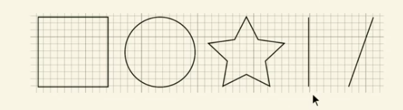
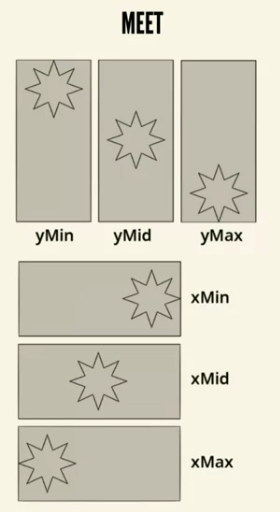
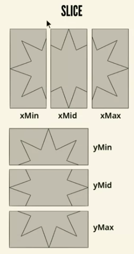
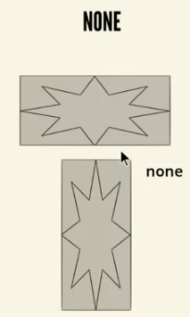

# Platonic shapes

```svg
<svg xmlns="" xmlns:xlink="" x="0px" y="0px" width="450px" height="100px" viewBox="0 0 450 100">
    <rect x="10" y="5" fill="white" stroke="black" width="90" height="90" />
    <circle fill="white" stroke="black" cx="170" cy="50" r="45" />
    <polygon fill="white" stroke="black" points="279,5 294,35 328.40 303,63 309.94 279,79" />
    <line fill="none" stroke="black" x1="410" y1="95" x2="440" y2="6" />
</svg>
```


# preserveAspectRatio

Default: `preserveAspectRatio="xMidYMid meet"`  



